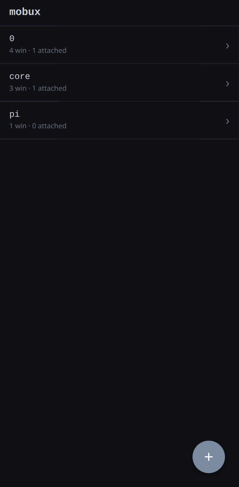
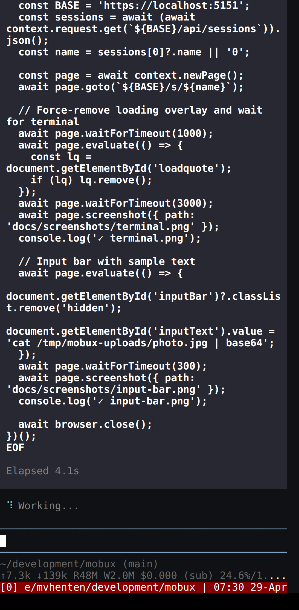

# mobux — overview

**Your development machine in your pocket.** mobux puts the terminal sessions running on your server onto your phone, in a form built for a phone, over your own private network.

## What it is

A touch-native web UI for tmux. You attach to a real session on your server and drive it by touch: a control-key ribbon where a keyboard would be, swipe gestures for the things you'd normally reach for a key combo, a reader view for scrollback, voice capture for input, and a push notification on your phone the moment a long job finishes. The session never leaves the server — the phone is just a good window into it.

  
  

## The problem

The work lives on a server — builds, training runs, deploys, the long-lived shell holding all your context. You are not always at your desk. The device you actually carry is a phone, and a phone is a miserable terminal: no control keys, untrustworthy scrollback, browsers that fight the keyboard, SSH apps stuck in the VT100 era. So the work waits until you're back at a real machine.

## Who it's for

Technical operators — developers, SREs, ML and infra engineers — who keep long-running work on remote machines and want to check on it, nudge it, or kill it without finding a laptop. People who already run their own infrastructure and a private network, and want a tool that respects that.

## Why now

- **Phones are everywhere; remote dev is the norm.** Real work increasingly runs on servers, in clusters, on GPU boxes — rarely on the laptop in front of you. The gap between "I have my phone" and "I can touch my server" is felt daily and poorly served.
- **The plumbing finally exists.** Tailscale makes a personal private network trivial, Web Push reaches locked phones, and PWAs / Trusted Web Activities let a web app install like a native one. mobux stitches these into one focused product.
- **Existing options miss the point.** Mobile SSH clients render a desktop terminal on a phone and call it done. mobux is designed phone-first: gestures over chords, a reader view over a cramped grid, a notification over a refresh.

## What works today

- Full tmux access from a mobile browser: attach, create, rename, kill sessions; switch windows.
- Touch input bar with a control-key ribbon and two send modes (execute vs. inject).
- Phone-tuned reader view for scrollback, with gesture scrolling, pinch-zoom, and swipe navigation.
- Web Push notifications driven by tmux's native bell event, deep-linked back to the source session, on locked phones.
- Voice capture from the input bar, transcribed by an OpenAI-compatible speech-to-text backend you run yourself (self-hosted whisper.cpp recipe included) or OpenAI's own endpoint.
- Listen mode that reads terminal output aloud.
- Muted, low-contrast themes built for phone use at night.
- One-tap OSC 133 shell integration for bash, zsh, fish.
- Installable as a PWA, or as a signed Android app (Trusted Web Activity) that mobux serves itself.
- Single self-contained Rust binary; HTTPS by default (self-managed CA or Let's Encrypt via ACME); PIN auth; tailnet-only by design.

## On the roadmap

- **Modernizing the UI** toward a component-based single-page app, for a faster and more maintainable frontend.
- **Replacing the legacy terminal renderer** with a clean-room, permissively licensed engine (already switchable as an experimental option).
- **Multi-host mesh** — reaching sessions across several of your machines from one app — is in active development.

## Honest footing

mobux is an open-source project (MIT) that began as one engineer's daily driver and is being hardened for others to run. There is no hosted service, no accounts, no telemetry, no users-or-revenue story to tell — and nothing that phones home. The bet is the product and the timing: remote dev is everywhere, the phone is always on you, and nothing bridges the two the way a phone deserves. mobux is that bridge.
