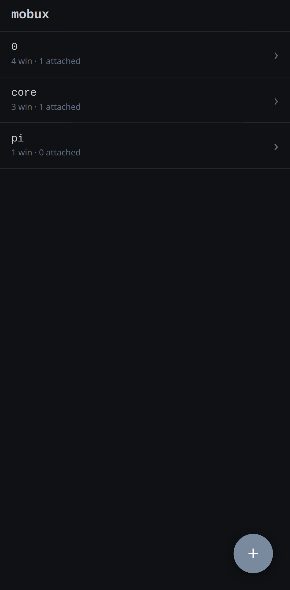
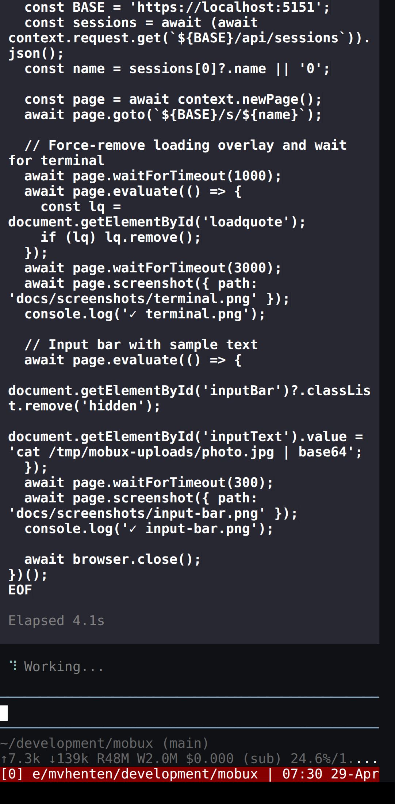
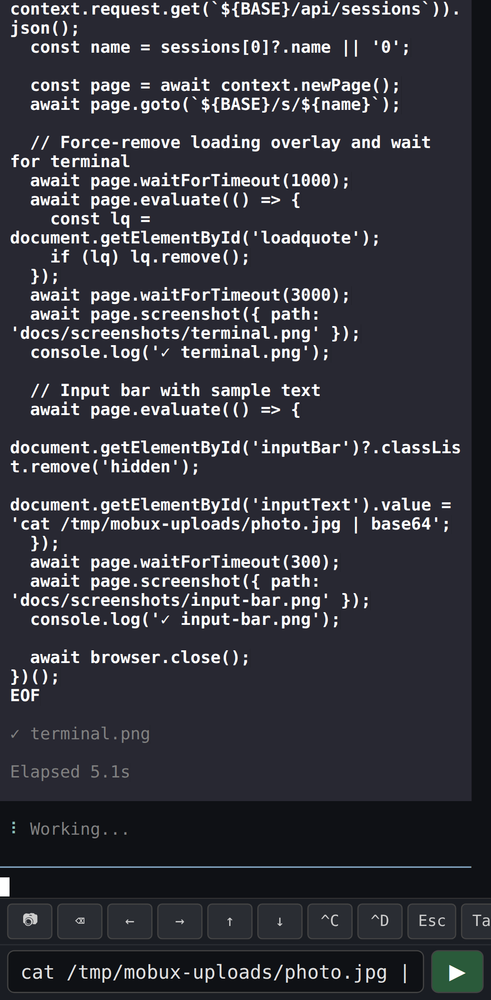

# mobux

**tmux on your phone.** Access your tmux sessions from a mobile browser over Tailscale with HTTPS.

<p align="center">
  
  
  
</p>

## Features

- **Full terminal** — xterm.js v6 with scrollback, colors, and links
- **Touch-native input** — bottom input bar with control key ribbon (^C, arrows, backspace, etc.) and native text field with autocomplete/voice support
- **Two send modes** — keyboard Enter executes; ▶ button injects text without Enter for readline editing
- **Image upload** — 📷 button uploads photos from camera/gallery, injects the file path into the terminal
- **Swipe gestures** — swipe sessions to rename/kill, swipe terminal to switch tmux windows, pinch to zoom, long-press for tmux commands
- **Session management** — create, rename, kill sessions from a mobile-native home screen
- **Secure** — self-signed TLS by default, HTTP Basic auth with PIN
- **PWA** — installable as a home screen app
- **TWA** — `make twa` builds a signed Android APK that mobux serves at `/install`; install once, get a real launcher icon and OS-level push notifications
- **Push on bell** — terminal `\x07` (BEL) fires a Web Push notification to every subscribed device, deep-linked back to the source session

## Quick Start

```bash
# Prerequisites: Rust, Node.js, tmux
git clone https://github.com/mvhenten/mobux.git
cd mobux
npm install          # installs deps, patches xterm.js, bundles
make run             # starts on https://0.0.0.0:5151
```

## Setup scripts

Two idempotent setup scripts provision everything needed to build mobux and
(optionally) the Trusted Web Activity APK. Both prefer user-local installs and
never use `sudo`. Run them as many times as you like — they detect existing
tools and skip them.

| Script | Make target | What it installs |
|---|---|---|
| `bin/setup` | `make setup` | Rust toolchain (rustup, cargo, rustc), `clippy`, `rustfmt`, and `npm install` for the web build. After this, `cargo build` and `node web/build.js` work. |
| `bin/setup-twa` | `make setup-twa` | TWA build toolchain: JDK 17 via SDKMAN (`~/.sdkman`), Node LTS via nvm (`~/.nvm`), Android command-line tools (`~/.android/cmdline-tools/latest`), platform-tools / build-tools / `android-34`, and `@bubblewrap/cli` (npm prefix `~/.local`). Accepts SDK licenses non-interactively. |

```bash
make setup        # rust + clippy + rustfmt + npm deps
make setup-twa    # JDK + node + android sdk + bubblewrap (only if you build the APK)
```

`bin/setup-twa` prints PATH/env hints at the end — paste them into your
shell rc so the user-local tools are visible in new shells.

Set auth credentials via environment:
```bash
export MOBUX_AUTH_USER=me
export MOBUX_PIN=12345
make run
```

## Architecture

```
┌──────────────┐     WebSocket      ┌──────────────┐
│  Phone       │◄──────────────────►│  mobux (Rust) │
│  xterm.js    │     /ws/:session   │  axum + PTY   │
│  input-bar   │                    │  tmux attach  │
│  touch.js    │     REST API       │               │
│              │◄──────────────────►│  /api/*       │
└──────────────┘                    └──────────────┘
```

- **Server**: Rust (axum) — serves static files, WebSocket terminal proxy, REST API for session/pane management, file upload
- **Client**: vanilla JS modules — xterm.js (patched, bundled with esbuild), touch gesture recognizer, mobile input bar
- **Build**: `node web/build.js` applies a diff patch to xterm.js's `CompositionHelper` and bundles with esbuild

## Patched xterm.js

xterm.js has [known issues](https://github.com/xtermjs/xterm.js/issues/2403) with mobile keyboard input. We apply a source-level patch (`patches/xterm-composition-helper.patch`) that fixes:

1. **Composition-based autocomplete** — mobile keyboards replace text via composition, not `insertReplacementText`. The original code computes wrong substring offsets.
2. **Broken diff algorithm** — `_handleAnyTextareaChanges` used `String.replace()` which fails when autocorrect changes characters.
3. **Backspace flood** — textarea clearing on Enter caused massive backspace sequences.

See [issue #9](https://github.com/mvhenten/mobux/issues/9) for the full investigation.

## Mobile Input

On mobile, the xterm.js hidden textarea is bypassed. Instead:

- **Input bar** appears on double-tap with a scrollable control key ribbon and a native text input
- **Keyboard Enter** sends text + carriage return (executes)
- **▶ button** sends text without Enter (injects into readline for further editing)
- **Ribbon keys** send control sequences directly (^C, arrows, Tab, Esc, etc.)
- **📷 button** uploads images to `/tmp/mobux-uploads/` and sends the path to the terminal

## API

| Endpoint | Method | Description |
|---|---|---|
| `/api/sessions` | GET | List tmux sessions |
| `/api/sessions` | POST | Create session `{"name": "..."}` |
| `/api/sessions/:name/kill` | POST | Kill session |
| `/api/sessions/:name/rename` | POST | Rename session `{"name": "..."}` |
| `/api/sessions/:name/panes` | GET | List panes/windows |
| `/api/sessions/:name/command` | POST | Run tmux command |
| `/api/sessions/:name/history` | GET | Capture scrollback |
| `/api/upload` | POST | Upload file (multipart) |
| `/api/push/vapid-public-key` | GET | VAPID public key (base64url) for client `pushManager.subscribe` |
| `/api/push/subscribe` | POST / DELETE | Register / unregister a Web Push subscription |
| `/api/push/devices` | GET | List subscribed devices |
| `/ws/:name` | WS | Terminal WebSocket |
| `/install` | GET | Self-service install page (CA cert, APK, QR codes) — no auth |
| `/install/mobux.apk` | GET | Built APK download — no auth |
| `/install/mobux-ca.crt` | GET | Local CA cert for Android trust store — no auth |
| `/.well-known/assetlinks.json` | GET | Digital Asset Links file proving the APK owns the domain — no auth |

## Development

```bash
make build      # patch xterm + esbuild + cargo build
make run        # build + run
make test       # playwright smoke tests (mobile Chrome)
make restart    # stop + start as background daemon
```

## Building the TWA

mobux ships its own Trusted Web Activity APK so you can install it as a real
Android app (full-screen, no browser chrome, push notifications). The APK is
built per-domain — different domain, different APK.

Prereqs: run `bin/setup-twa` once (installs JDK 17, Node, Android cmdline-tools,
`@bubblewrap/cli`). Then a single command builds everything:

```bash
make twa MOBUX_DOMAIN=mobux.example.com:5151   # port included if non-standard
```

This will:

1. Generate a signing keystore at `~/.config/mobux/twa-signing.keystore` on
   first run (random password written to `~/.config/mobux/twa-signing.password`,
   mode 0600). Override the password via `MOBUX_TWA_KEYSTORE_PASSWORD`, override
   the config dir via `MOBUX_CONFIG_DIR`.
2. Render `twa/twa-manifest.json` from the template with your domain.
3. Bootstrap the bubblewrap project skeleton via `node twa/init.js`, which
   calls `@bubblewrap/core` directly with the rendered manifest. The bundled
   `bubblewrap init` CLI is interactive-only and treats `--manifest=` as a
   remote PWA manifest URL — neither fits a one-command build.
4. Run `bubblewrap build` (passwords passed as `BUBBLEWRAP_KEYSTORE_PASSWORD` /
   `BUBBLEWRAP_KEY_PASSWORD` env vars).
5. Copy the signed APK to `web/static/install/mobux.apk`.
6. Write `web/static/.well-known/assetlinks.json` with the cert fingerprint so
   Android trusts the TWA → domain link.

The build needs mobux running with TLS during the icon-fetch step (bubblewrap
fetches `iconUrl` from the live server). If you use mobux's own self-signed CA,
set `NODE_EXTRA_CA_CERTS=$HOME/.config/mobux/ca.crt` before running `make twa`
(the target sets it automatically when the file exists).

**BACK UP YOUR KEYSTORE.** `~/.config/mobux/twa-signing.keystore` (and the
matching password file) are the only thing standing between you and a broken
upgrade path: lose the key and existing installs cannot upgrade — only fresh
install with a new package will work, and the package id `io.github.mvhenten.mobux`
is then burned for those users.

## Install on a phone

Once the APK is built, the rest of the install is self-service from the phone.

1. On the phone, open `https://<your-mobux-host>/install` in Chrome. (You'll
   get a "Not secure" warning until step 2 completes — tap through.)
2. **Install the CA certificate first.** Tap "Download CA certificate", then
   open Android Settings → Security & privacy → Encryption & credentials →
   Install a certificate → CA certificate → pick `mobux-ca.crt` from
   Downloads. The page has the exact menu path; follow the steps in order.
3. Reload `/install` — the address bar padlock should go green.
4. Tap "Download APK", install. The Mobux app appears in your launcher.
5. Open the app, attach to a session, tap 🔔 in the input bar, accept the
   notification permission.
6. Test it: from any session, run `echo -e '\a'` with the phone locked —
   the lock screen lights up with `session N: 🔔` and tapping it opens the
   session.

For a desktop → phone handoff (e.g. you're configuring a fresh phone from
your laptop), `/install` shows a QR code next to each download button. Scan it
with the phone camera to jump straight to the right URL.

If you're running mobux behind a publicly-trusted cert (Let's Encrypt — set
`MOBUX_ACME_DOMAINS` and `MOBUX_ACME_EMAIL`), the CA install step is skipped
entirely; the install page won't even render that section.

## License

ISC
