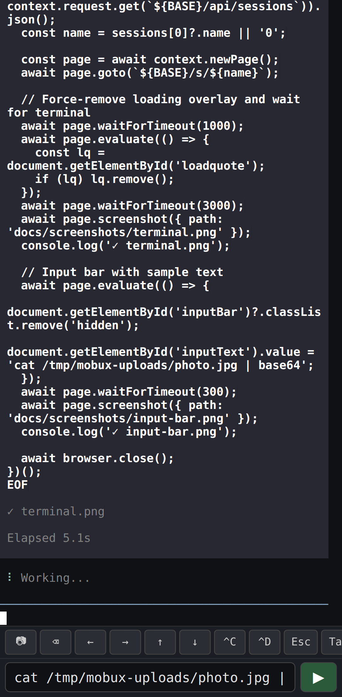

# mobux

**Your development machine in your pocket.** mobux is a touch-native web UI for tmux: open any terminal session on your server straight from your phone, over your own private network.

<p align="center">
  
  
  
</p>

## The problem

Your real work lives on a server: builds, training runs, deploys, the long-lived shell with all your context in it. But you are not always at your desk. You are walking, commuting, away from the keyboard — and the thing you actually have on you is a phone.

A phone is a terrible terminal. Tiny keys, no control keys, no scrollback you can trust, browsers that fight you over the keyboard, and SSH apps that treat the screen like a 1980s VT100. So the work waits until you are back at a real machine.

mobux closes that gap. It puts your tmux sessions on the phone in a form built for a phone — touch gestures instead of key combos, a control-key ribbon where a keyboard would be, a reader view for scrollback, and a push notification when the long job finishes. The session keeps running on the server the whole time. The phone is just a good window into it.

## What it does

- **Full terminal, touch-first.** Attach to any tmux session and drive it by touch. A bottom input bar carries the keys a phone keyboard lacks — `^C`, arrows, `Tab`, `Esc`, and more — on a scrollable ribbon. Two send modes: Enter executes; a separate inject button drops text into the line for readline editing without running it.
- **Built for reading on a phone.** A dedicated reader view renders scrollback with smooth, synthetic scrolling tuned for mobile WebViews, so long output is actually browsable. Pinch to zoom, swipe to switch windows.
- **Gestures, not chords.** Swipe a session to rename or kill it. Swipe the terminal to move between tmux windows. Long-press for tmux commands. The things you'd reach for a key combo for become a gesture.
- **Notified when it matters.** A long job finishing rings the terminal bell; mobux turns that into a Web Push notification on your phone — even with the screen locked — deep-linked back to the exact session. It hooks tmux's own bell event, so a notification means a real bell fired, not a guess scraped off the screen.
- **Voice capture.** Record a voice note from the input bar; mobux uploads the audio and transcribes it through a speech-to-text backend you run on your own network. The backend speaks the OpenAI audio API, so it can be self-hosted whisper.cpp on your tailnet, a fully offline local transcriber, or OpenAI's own endpoint — your choice. A ready-to-run, tailnet-only whisper.cpp recipe ships in [`deploy/stt/`](deploy/stt/README.md).
- **Reads output aloud.** An optional listen mode speaks terminal output through the device's voice, with selectable voice, rate, and pitch — useful when you're not looking at the screen.
- **Themed for night use.** Muted, low-contrast color themes (Gruvbox Soft, Tomorrow Night Soft, Nord, Solarized, and more) chosen for a phone screen in a dark room, not a desktop in daylight.
- **Shell integration, one tap.** Install OSC 133 prompt markers for bash, zsh, or fish from the settings page, so mobux can tell prompts from output and mark command boundaries cleanly under tmux.
- **A real app, not just a tab.** Installable as a PWA, or build a signed Android app (Trusted Web Activity, package id `io.github.mvhenten.mobux`) that mobux serves from `/install` — full-screen, a launcher icon, and OS-level push.

## Security posture

mobux is meant to live on your private network, not the open internet.

- **Private by network.** The intended deployment is behind [Tailscale](https://tailscale.com/): mobux is reachable only on your tailnet, never exposed publicly. The voice transcription recipe is the same — tailnet-only, no public surface.
- **HTTPS always.** mobux serves TLS by default. It generates and manages its own CA so phones can trust it (the `/install` page walks you through adding the cert), or it can obtain a real Let's Encrypt certificate via ACME if you give it a public domain.
- **PIN / Basic auth.** Access is gated by HTTP Basic auth with a user and PIN you set via environment variables.

## Quick start

```bash
# Prerequisites: Rust, Node.js, tmux  (run `make setup` to install the toolchain)
git clone https://github.com/mvhenten/mobux.git
cd mobux
npm install                 # installs deps and bundles the frontend

export MOBUX_AUTH_USER=me
export MOBUX_PIN=12345
make run                    # builds and starts on https://0.0.0.0:5151
```

Then open `https://<your-host>:5151` from a phone on the same tailnet.

Common targets:

```bash
make setup        # install Rust toolchain + npm deps
make build        # bundle frontend + cargo build
make run          # build and run on :5151
make test         # Playwright smoke tests (mobile Chrome)
make twa MOBUX_DOMAIN=mobux.example.com:5151   # build the signed Android app
```

Deploying to a phone (CA cert install, APK download, QR handoff) is self-service from the `/install` page. The full production runbook — systemd service, releasing, isolated dev instances — is in **[DEPLOY.md](DEPLOY.md)**.

## Architecture at a glance

```
┌──────────────┐     WebSocket      ┌───────────────┐
│  Phone        │◄──────────────────►│  mobux (Rust)  │
│  terminal     │     /ws/:session   │  axum + PTY    │
│  input bar    │                    │  tmux attach   │
│  reader view  │     REST API       │                │
│               │◄──────────────────►│  /api/*        │
└──────────────┘                    └───────────────┘
```

- **Backend — Rust.** An [axum](https://github.com/tokio-rs/axum) server proxies a PTY-attached tmux session over a WebSocket and exposes a small REST API for session, pane, upload, and push management. The whole frontend is compiled into the binary, so the result is a single self-contained executable that runs from anywhere — `cargo install mobux` and go.
- **Frontend — JavaScript.** A touch gesture recogniser, the mobile input bar, and the terminal view ship as bundled JS modules. The terminal renderer is pluggable: [xterm.js](https://xtermjs.org/) is the stable default; an experimental clean-room renderer ([sterk](https://github.com/kattebak/sterk)) can be switched on in settings as we modernize the rendering path.
- **Notifications.** Web Push (VAPID) driven by tmux's native `alert-bell` hook.

## Project status

mobux started as a personal tool and is being hardened into something others can run. It works today — it is the author's daily way to reach a dev box from a phone. It is open source under the MIT license. There is no hosted service, no accounts, and nothing phones home; you run it on your own machine.

The UI is being modernized toward a component-based single-page app. That migration is in progress; the current frontend described above is what ships today.

A short product overview for the curious is in **[OVERVIEW.md](OVERVIEW.md)**.

## API

| Endpoint | Method | Description |
|---|---|---|
| `/api/sessions` | GET / POST | List or create tmux sessions |
| `/api/sessions/:name/kill` | POST | Kill a session |
| `/api/sessions/:name/rename` | POST | Rename a session |
| `/api/sessions/:name/panes` | GET | List panes / windows |
| `/api/sessions/:name/command` | POST | Run a tmux command |
| `/api/sessions/:name/history` | GET | Capture scrollback |
| `/api/upload` | POST | Upload a file (multipart) |
| `/transcribe` | POST | Speech-to-text (OpenAI-compatible audio endpoint) |
| `/api/push/vapid-public-key` | GET | VAPID public key for push subscription |
| `/api/push/subscribe` | POST / DELETE | Register or unregister a push subscription |
| `/api/push/devices` | GET | List subscribed devices |
| `/api/push/notify` | POST | Send a push notification |
| `/ws/:name` | WS | Terminal WebSocket |
| `/install` | GET | Self-service install page (CA cert, APK, QR codes) — no auth |
| `/install/mobux.apk` | GET | Built APK download — no auth |
| `/install/mobux-ca.crt` | GET | Local CA cert for Android trust store — no auth |
| `/.well-known/assetlinks.json` | GET | Digital Asset Links file proving the APK owns the domain — no auth |

### Dev telemetry

A dev-only client telemetry channel for debugging the frontend on a real
device. It is **off by default and inert in production** — gated behind the
`MOBUX_DEV` env var, read once at startup.

- **Enable it:** start mobux with `MOBUX_DEV=1` (the `mobux-dev.service`
  unit sets this). When set, the server logs `dev mode: ON` and exposes the
  flag to the page as `window.MOBUX_DEV = true`.
- **Where logs land:** the frontend POSTs lines to `POST /api/telemetry`
  (same-origin, behind normal auth, body capped at 64KB). The server writes
  each line to **stderr / the journal** prefixed `[telemetry HH:MM:SS.mmm]`.
  Tail with `journalctl --user -u mobux-dev -f` (or `/tmp/mobux*.log` for a
  `make` instance). When `MOBUX_DEV` is unset, `/api/telemetry` returns 404
  and nothing is logged.
- **From JS:** the module is `web/static/telemetry.js`, loaded once by the
  SPA's entrypoint. It resolves the dev flag itself from `/api/build-info`
  (no server-side HTML injection needed) and is a no-op until that resolves
  true. Import it anywhere for logging:
  ```js
  import telemetry from '/static/telemetry.js';
  telemetry.log('ws-open', { session });   // structured or a plain string
  ```
  Each line carries a per-page session id so they're correlatable.
- **On-screen overlay:** add `?telemetry=1` to the URL, or run
  `telemetry.overlay(true)` (also `window.mobuxTelemetry.overlay()` in dev).
  The choice persists in `localStorage['mobux:telemetry']`.

## License

MIT. Third-party attributions are in [`THIRD_PARTY-LICENSES.md`](./THIRD_PARTY-LICENSES.md).
